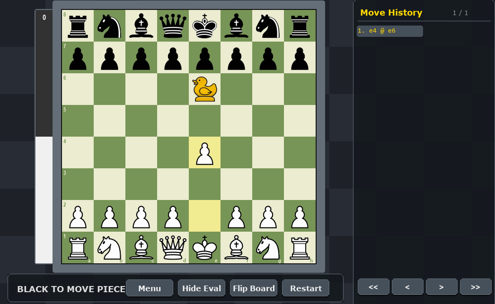

# 🦆 Duck Chess - UI Implementation

**A Python-based graphical interface for the "Duck Chess" variant.**

> ⚠️ **Note:** This repository currently focuses on the **User Interface (UI)** and game rules implementation. It serves as the foundation for my upcoming B.Sc. Final Project, where I will develop and integrate a custom C++ Chess Engine using Reinforcement Learning.

---

### 📖 About the Project

**Duck Chess** is a chess variant where, in addition to moving a piece, players must move a "Duck" (a neutral blocker piece) to an empty square. The Duck cannot be captured and blocks lines of sight for sliding pieces.

This project implements the full rules of the game and provides a graphical environment to play it manually. It is built to communicate with a future backend engine via standard protocols (like UCI or custom pipes).

### 🛠️ Tech Stack

* **Language:** Python 3.10+
* **Graphics:** Pygame
* **Future Integration:** C++ (for the Engine/AI)

### ✨ Features

* **Full Rules Implementation:** Legal move generation including Duck placement, castling, and en passant.
* **Interactive UI:** Drag-and-drop mechanics for pieces and the Duck.
* **Visual Validations:** Highlights legal moves and prevents illegal placements.
* **Modular Design:** Separated logic for the Board, Pieces, and Graphics to easily plug in an AI engine later.

### 🚀 Roadmap (Final Project Goals)

This UI is the first step towards a complete Chess Engine. The next phases include:
1.  **Engine Development:** Writing a high-performance Move Generator in **C++**.
2.  **AI Implementation:** Implementing Minimax with Alpha-Beta pruning, and exploring **Reinforcement Learning** for evaluation functions.
3.  **Integration:** Connecting this Python UI with the C++ Engine executable.

---

### 💻 How to Run

1.  Clone the repository:
    ```bash
    git clone [https://github.com/harel3782/YOUR_REPO_NAME.git](https://github.com/harel3782/YOUR_REPO_NAME.git)
    ```
2.  Install dependencies:
    ```bash
    pip install pygame
    ```
3.  Run the game:
    ```bash
    python main.py
    ```

---

### 📷 Screenshots


