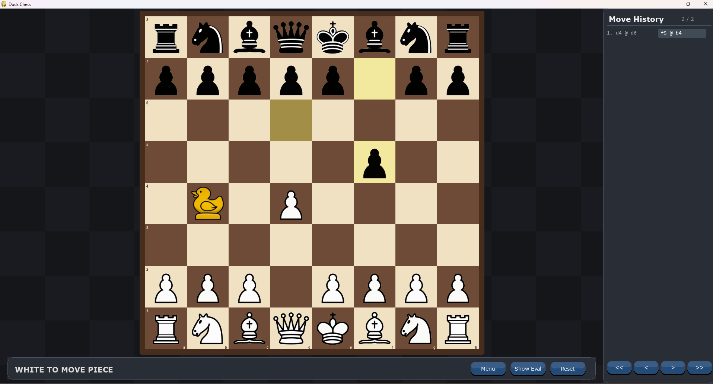
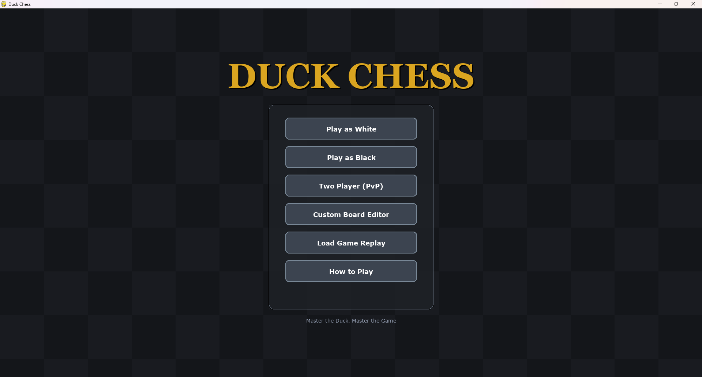

# 🦆 Duck Chess - AI Engine & UI

**A Developing Environment and Reinforcement Learning Agent for the "Duck Chess" variant.**

> 🎓 **B.Sc. Final Project in Computer Science @ Afeka College of Engineering**

---

### 📖 About the Project

**Duck Chess** is a highly dynamic chess variant where, in addition to making a standard move, players must relocate a neutral "Duck" piece to an empty square on the board. The Duck acts as an indestructible blocker—it cannot be captured, and it blocks the movement and line of sight for sliding pieces. 

This project evolved from a basic UI implementation into a **complete Reinforcement Learning (RL) ecosystem**. It features a custom, lightning-fast 64-bit Bitboard engine, a modern Pygame GUI, and an advanced AI agent trained from scratch using **Maskable Proximal Policy Optimization (MaskablePPO)** via Self-Play.

### 🛠️ Tech Stack

*	**Language:** Python 3.10+ (with C++ extensions for engine optimization)
*	**AI / Machine Learning:** PyTorch, Stable-Baselines3 (SB3), `sb3-contrib`
*	**Engine Logic:** Custom 64-bit Bitboard Operations (Numpy/C++)
*	**Graphics & UI:** Pygame

### ✨ Key Features

*	**Full Variant Rules Implementation:** Handles unique Duck Chess mechanics (No checks, Fowling/Stalemate rules, Castling through attacks, etc.).
*	**Deep Reinforcement Learning Agent:** Trained via self-play using a 7-stage Curriculum Learning pipeline.
*	**Action Masking:** Efficiently filters 4,096 possible action combinations to prevent illegal moves during neural network evaluation.
*	**Opponent Pool (Robustness):** Combats mode-collapse and overfitting by drawing historical opponent checkpoints and stochastic behavior (Greedy/Random).
*	**Interactive UI & Replays:** Drag-and-drop mechanics, visual move validation, evaluation bar, and a comprehensive JSON/PKL replay system for analyzing RL games.
*	**Custom Board Editor:** Setup custom scenarios to test the AI.

### 🧠 RL Training Pipeline (Curriculum Learning)

The AI is trained progressively to master the chaos of Duck Chess:
1.	**Stage 1 & 2 (Random & Greedy):** Baseline agents and heuristic capture-focused bots.
2.	**Stage 3 (Self-Play):** Introduction of the dual-color learning environment.
3.	**Stage 4 (Dense Rewards):** Reward shaping based on material advantages.
4.	**Stage 5 (Strategic):** Incentivizing defensive Duck placements to block threats.
5.	**Stage 6 (Advanced Time Penalties):** Forcing shorter games to eliminate stalling and encourage checkmates.
6.	**Stage 7 (Robustness):** Introducing a historical Opponent Pool with stochastic play to generalize the agent's strategy.

---

### 💻 How to Run

1.	Clone the repository:
	```bash
	git clone [https://github.com/harel3782/YOUR_REPO_NAME.git](https://github.com/harel3782/YOUR_REPO_NAME.git)
	```
2.	Install the required dependencies:
	```bash
	pip install pygame numpy torch stable-baselines3 sb3-contrib
	```
3.	Run the graphical interface to play against the AI:
	```bash
	python -m DuckChess_Game.UI.main
	```
4.	*(Optional)* Run the training pipeline:
	```bash
	python -m DuckChess_Game.SBThree.train
	```

---

### 📷 Screenshots



